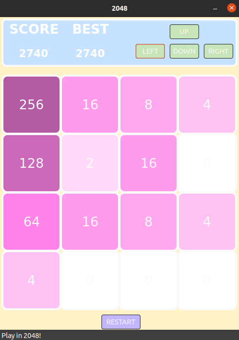

# 2048 
Jest to klon popularnej gry 2048.
Zasady tej gry są proste. Aby wygrać należe uzyskac wynik 2048 przez poruszanie klockami.

# Jak grać?
Można sie poruszać w góre, dół, prawo i lewo strzałkami, które znajdują się nad planszą.
Klocki łączą się ze sobą kiedy maja takie same wartości i powstaje z nich klocek, który jest ich sumą.
Po każdym wykonanym ruchu na planszy w losowym wolnym miejscu pojawia się klocek z wartością 2 lub 4.
Kiedy plansza jest wypełniona i nie ma możliowści wykonania ruchu gra się kończy :worried:.  
Rozgrywkę w każdej chwili można zrestartować, przy czym najlepszy wyniki osiągnięty zapisuje się.

# Screenshot z gry
#####  Do wizualizacji gry została uzyta biblioteka wxWidgets

Jeśli uda Ci się osiągnąć wynik 2048 czeka Cię niespodzianka :cat:

## Dobrej Zabawy! :sparkles:
